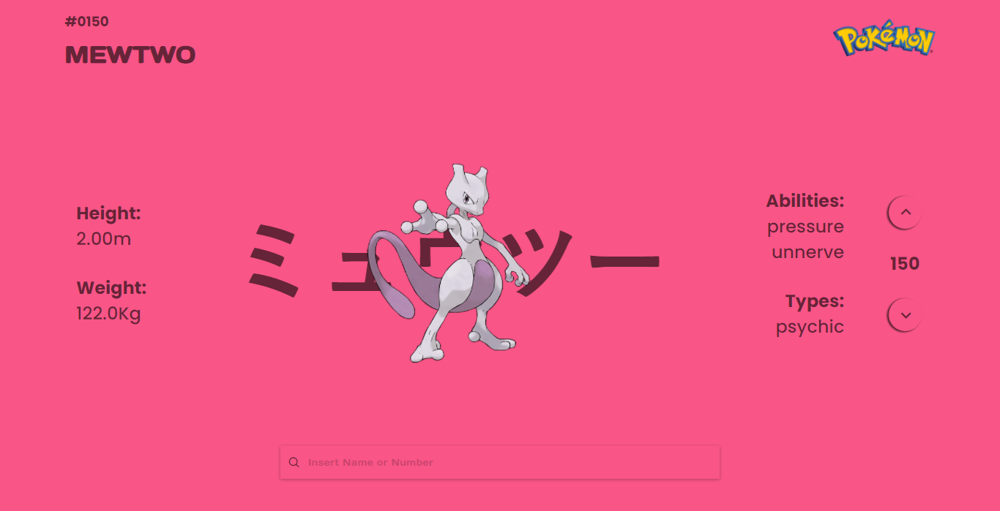
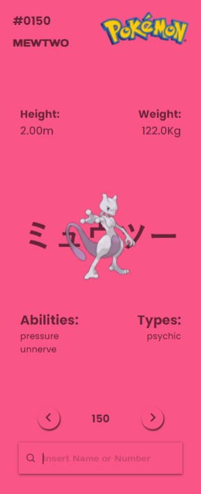

# LaunchX: Pokédex

## Pokédex hecha con Vanilla JS

1. [Resultado Final ](https://github.com/JhosianGtZ/Pokedex)

2. [UI/UX](https://dribbble.com/shots/2859891--025-Pikachu)

3. [Iconos: Boxicons](https://boxicons.com/)

4. [Font: Monsterrat](https://fonts.google.com/specimen/Montserrat)

5. [Font: Days One](https://fonts.google.com/specimen/Days+One)

# Hecho con:

  

# ScreenShots

Desktop View 

Mobile View 

# Contact Links

